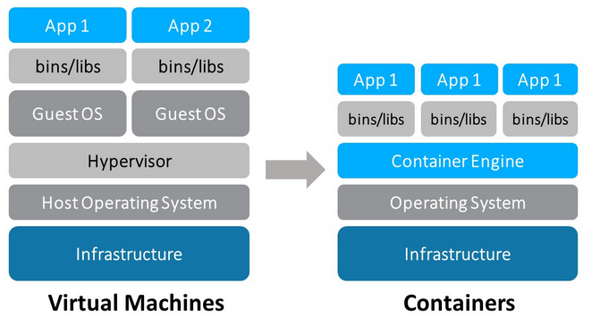

# Workshop de Docker

# Pauta

## O quê é?

Tenologia de gerenciamento de contêineres que fornece uma camada de abstração da infraestrutura e automação de vitualização do sistema operacionais e aplicações.

## O que é container?

Container é uma forma de isolar a aplicação do sistema operacional Host, em resumo reduzindo consideravelmente o tempo de deploy e as diferenças entre ambiente de desenvolvimento e produção.

Diferente de uma máquina virtual, o sistema operacional do Container não utiliza um hardware emulado, mas sim a camada de comunicação do próprio host para acessar o Hardware (Kernel).

Além disso, a tecnologia de contêineres permite que a máquina seja montada em camadas, chamadas de Layers.

A base para um novo container é chamada de imagem. Uma imagem contém a aplicação e todas as dependências que esta precisar para executar

## Pra quê serve?

 - Desenvolvimento - Parar
 - DevOps - Parar

# Referências e outros Links

## Portabilidade entre Hosts Linux e Windows

- Atualmente para Windows Server ou 10 Pro, roda sobre o WSL (Windows Subsystem for Linux). Que é um módulo padrão do sistema que permite a instalação de uma Distro Linux dentro do SO Windows, com acesso direto aos recursos de Hardware.

- Para outros sistemas Windows (W8.1, W10 Home), vai rodar em modo de compatibilidade, sobre uma VM do VirtualBox

- Já está liberado para W10 Insiders Preview o WSL 2. A segunda versão promete ser muito aprimorada e usará um Kernel real do Linux embarcado no Windows. Expectativa de performance aumenta em até 20x para o WSL 1.

Como o WSL 2 funciona no Windows 10 Home Edition, o Docker Desktop também funcionará.
Abrir este Link:
Docker ❤️️ WSL 2 - The Future of Docker Desktop for Windows - Docker Engineering Blog

Lendo este artigo e as outras notícias é correto afirmar: Docker roda no Linux.
O que acontece é que agora a MS vai rodar Linux dentro do W10 mais integrado.

https://sempreupdate.com.br/microsoft-lanca-window…

https://devblogs.microsoft.com/commandline/wsl-2-i…

https://docs.microsoft.com/en-us/windows/wsl/wsl2-…
https://docs.microsoft.com/en-us/windows/wsl/wsl2-…

